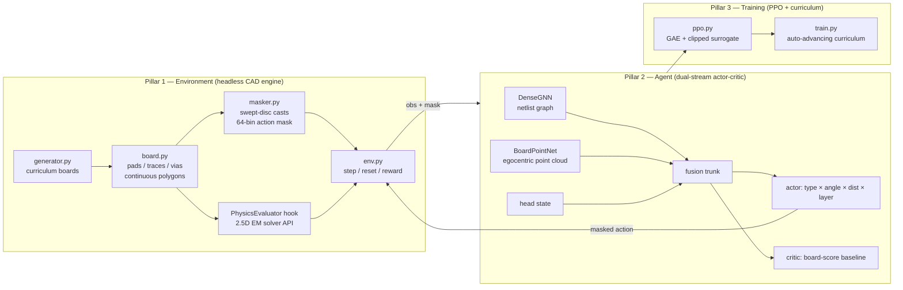

# Gridless PCB Routing AI — Full Project Document

An autonomous PCB routing engine that learns to route boards with
reinforcement learning in **continuous, gridless vector space** — no pixel
grids, no fixed routing lattice. Traces can leave a pad at any angle and any
length; legality is enforced by computational geometry, not discretization.

---

## 1. Design decisions (and why)

### Python-first engine (the Colab question)

Google Colab *can* compile C++ (it is a Linux VM with g++), but iterating on
native code inside a notebook is slow and painful. So the engine is **pure
Python + NumPy**, written so that every hot path is a vectorized array
operation (the same math as a C++ kernel, executed by NumPy's C internals).
The entire project runs on a stock Colab instance with **zero installs** —
`numpy` and `torch` are preinstalled.

The C++ design is preserved in `cpp/include/pcb/action_masker.hpp` as the
specification for a later 1:1 performance port (pybind11). The Python
`masker.py` implements exactly that interface.

### Legal-by-construction actions (the core trick)

A binary action mask over a *continuous* action space is mathematically
ill-posed — you cannot enumerate an uncountable set. The resolution:

- **Direction** is discretized into 64 angle bins → maskable Categorical.
- **Distance** stays continuous, but the policy emits a **fraction ∈ (0,1)**
  of the per-bin *maximum legal distance* that the geometry engine computes
  with a swept-disc cast.

Every sampled action is therefore legal **by construction**. The DRC penalty
in the reward exists only as a float-tolerance assertion; in testing it fires
exactly zero times (see §6).

### One net at a time, easy-first

The agent routes nets sequentially in ascending-HPWL order. Completed copper
becomes an obstacle for subsequent nets. (Net-ordering as a learned decision,
and rip-up/re-route, are roadmap items — §8.)

---

## 2. Architecture — the three pillars



### Pillar 1 — Environment (`python/pcb_router/`)

| File | Role |
|---|---|
| `geometry.py` | Vectorized kernel: ray-vs-disc, ray-vs-capsule first-contact casts, board-outline clipping. Validated against brute-force ray marching. |
| `board.py` | Continuous-space board state. All copper reduces to **discs** (pads, vias, keep-outs) and **capsules** (thick trace segments). Lists compile to cached flat NumPy arrays. |
| `masker.py` | Dynamic action masking. Per step: 64 max-legal-distance casts (one AABB broad-phase window + local narrow phase — the "one windowed R-tree query" design), via-fit checks per layer, commit legality. |
| `env.py` | Gym-style MDP. Reward implements `docs/reward-function.md` exactly. `PhysicsEvaluator` is the 2.5D EM-solver hook (returns zeros until a solver/surrogate plugs in). |
| `generator.py` | Programmatic curriculum boards, stage 0 → 5 (see §5). |

### Pillar 2 — Agent (`python/pcb_router/model.py`)

- **Logical stream** — `DenseGNN`: 3 rounds of message passing over the
  netlist (nodes = pads with position/layer/net-status/impedance/signal-type
  features; edges = required nets). Dense padded adjacency (≤64 pins) keeps
  batching trivial and needs no torch_geometric.
- **Physical stream** — `BoardPointNet`: shared MLP + symmetric max-pool over
  an **egocentric** point cloud (≤256 points) sampled from nearby copper,
  keep-outs, and the target pad, with layer offsets and same-net flags.
  Egocentric framing is deliberate: local congestion matters most, and it
  makes the policy translation-invariant.
- **Fusion** — `[graph_global | current_net_embed | board_global | head_state]`
  → MLP trunk → four actor heads + critic:
  - type: masked Categorical over {EXTEND, PLACE_VIA, COMMIT_NET}
  - angle: masked Categorical over 64 bins
  - distance: **Beta distribution** over the legal fraction (naturally bounded)
  - layer: masked Categorical over via targets
- Masking: `logits + (1 − mask)·(−1e9)` before sampling; joint log-prob is the
  sum of the four components (standard parameterized-action PPO).

### Pillar 3 — Training (`ppo.py`, `train.py`)

Standard PPO: GAE(λ=0.95), clip 0.2, entropy bonus, value-loss coefficient
0.5, Adam 3e-4, γ=0.995 (matches the reward spec). The trainer auto-advances
the curriculum stage when the rolling completion rate over 20 episodes clears
95%, and checkpoints every rollout.

---

## 3. Reward function

Full math with all constants: [`docs/reward-function.md`](docs/reward-function.md).
Summary: +C per completed net; per-step length penalty **normalized by the
net's HPWL lower bound** (so reward scale survives curriculum growth — the
agent is punished for its *detour factor*, not raw millimetres); via penalty;
potential-based shaping toward the target (policy-invariant); terminal
completion bonus/failure penalty plus impedance / skew / crosstalk penalties
from the physics hook.

---

## 4. Repository map

```
Router2/
├── PROJECT.md                    ← this document
├── CLAUDE.md                     ← working notes for AI pair-programmers
├── requirements.txt              ← numpy, torch (both preinstalled on Colab)
├── docs/reward-function.md       ← reward math, single source of truth
├── cpp/include/pcb/action_masker.hpp   ← C++ port specification (future)
└── python/
    ├── pcb_router/
    │   ├── config.py             ← action-space contract + design rules
    │   ├── geometry.py           ← vectorized continuous-space kernel
    │   ├── board.py              ← board state (discs + capsules)
    │   ├── masker.py             ← dynamic action masking
    │   ├── env.py                ← RL environment + physics hook
    │   ├── generator.py          ← curriculum board generator
    │   ├── model.py              ← DualStreamRouter (pure torch)
    │   ├── ppo.py                ← PPO + GAE + rollout collection
    │   └── train.py              ← curriculum training entry point
    └── tests/
        ├── test_geometry.py      ← analytic casts vs brute-force marching
        ├── test_env.py           ← legality fuzz + independent DRC check
        └── test_model_ppo.py     ← model/PPO smoke tests
```

---

## 5. Curriculum

| Stage | Layers | Board | Nets | Keep-outs | Cross-layer pads (forces vias) |
|---|---|---|---|---|---|
| 0 | 2 | 20×20 mm | 3 | 0 | — |
| 1 | 2 | 25×25 mm | 6 | 2 | — |
| 2 | 2 | 25×25 mm | 8 | 2 | 30% |
| 3 | 4 | 30×30 mm | 12 | 4 | 30% |
| 4 | 6 | 40×40 mm | 20 | 8 | 40% |
| 5 | 12 | 50×50 mm | 30 | 12 | 50% |

Scaling beyond (1000-pin BGA, differential pairs) requires raising
`N_MAX_PINS`/`P_MAX` in `config.py` and the roadmap items in §8.

---

## 6. Verification status (all run, all passing)

- **Geometry**: analytic first-contact distances match brute-force ray
  marching over 600 randomized cases (worst error < 1e-3 mm = the march
  resolution).
- **Legality fuzz**: 15 episodes × up to 1152 random *masked* actions across
  stages 0/1/3 → **0 DRC flags**, and an independent O(n²) re-check of the
  final copper confirms every gap ≥ 0.150 mm (the clearance rule).
- **Model/PPO**: forward, act/evaluate log-prob consistency, and a full PPO
  update produce finite losses.
- **Learning** (measured, 49k steps of PPO on stage 0, laptop CPU): rolling
  completion rate **4.8% → 35.0%**, mean episode return **−115 → −48**, policy
  entropy 4.92 → 4.25, with the curve still rising at cutoff. The random-walk
  baseline sits at ~0–5% completion. Rendered rollouts show the agent
  connecting nets (wastefully — the length/via penalties haven't disciplined
  it yet) with zero DRC violations throughout. Longer runs and the §8 roadmap
  items (parallel envs, imitation warm-start) are the path to saturating
  stage 0 and advancing the curriculum.

Run everything:

```bash
cd python
python tests/test_geometry.py
python tests/test_env.py
python tests/test_model_ppo.py
```

---

## 7. How to run

### Locally

```bash
cd python
python -m pcb_router.train --stage 0 --total-steps 200000
# resume / continue on a later stage:
python -m pcb_router.train --stage 1 --resume checkpoints/router_stage0.pt
```

### On Google Colab (via GitHub)

Repo: https://github.com/Klutzhehe/Router-v2 — this is the workflow going
forward: push code changes from your machine, `git pull` in Colab, no more
zip/upload. Mount Drive first so checkpoints survive runtime resets.

```python
from google.colab import drive
drive.mount("/content/drive")

REPO_DIR = "/content/drive/MyDrive/Router-v2"
import os
if not os.path.isdir(REPO_DIR):
    !git clone https://github.com/Klutzhehe/Router-v2 "{REPO_DIR}"
%cd {REPO_DIR}/python
```

Re-running the clone cell after code changes on GitHub:

```python
%cd {REPO_DIR}
!git pull
%cd {REPO_DIR}/python
```

Train (GPU runtime accelerates the model; the env is CPU NumPy):

```python
!python -m pcb_router.train --stage 0 --total-steps 500000 --device auto \
    --save-dir /content/drive/MyDrive/Router-v2-checkpoints
```

Nothing to `pip install` — `numpy` and `torch` ship with Colab. Resuming
after a runtime reset just needs `--resume`:

```python
!python -m pcb_router.train --stage 0 \
    --resume /content/drive/MyDrive/Router-v2-checkpoints/router_stage0.pt \
    --save-dir /content/drive/MyDrive/Router-v2-checkpoints
```

Checkpoints and rendered PNGs are gitignored (see `.gitignore`) — they live on
Drive, not in the repo. If you want a trained checkpoint back on your local
machine, download it from Drive (or `git add -f` a specific file if you
really want it version-controlled, but Drive is the better home for large
binaries).

### Throughput expectations

The bare environment runs ~190 steps/s on a laptop CPU (profiled and
vectorized: the observation builder was the hotspot at 78% of step time, not
the geometry casts); with the policy in the loop, single-env training collects
~60–70 steps/s. The remaining optimization ladder, in order of payoff: run N
parallel envs with batched `model.act`, shrink `P_MAX`, and ultimately the C++
port of `masker.py`+`geometry.py` (the header is already written), which is
where "millions of frames per second" becomes realistic — and the mask, not
single collision checks, is the thing to optimize there too.

---

## 8. Roadmap

1. **Vectorized envs** — batch `model.act` across 8–32 parallel boards
   (biggest cheap speedup; PPO also benefits from decorrelated samples).
2. **Imitation warm-start** — A* teacher on the same DRC engine, behavior-clone
   its trajectories before PPO. Pure RL from scratch will not conquer large
   boards in hackathon time; the teacher doubles as the evaluation baseline
   the RL agent must beat.
3. **Rendering** — matplotlib/SVG board renderer for debugging and demos.
4. **Rip-up & re-route** — add a TEAR action or episode-level restarts so one
   badly placed net cannot permanently block another.
5. **Differential pairs** — paired routing heads, per-step skew proxy reward
   (running length mismatch is nearly free to compute).
6. **Physics solver** — implement the `PhysicsEvaluator` hook: start with a
   Hammerstad/Jensen microstrip impedance approximation (cheap, per-trace),
   graduate to a real 2.5D solver on subsampled episodes or a learned
   surrogate.
7. **C++ port** — pybind11 module implementing `action_masker.hpp`; drop-in
   replacement for `masker.py`.
8. **Search at inference** — the env is deterministic by design, so beam
   search / MCTS over the trained policy can squeeze out extra completion
   rate when routing a real board offline.
